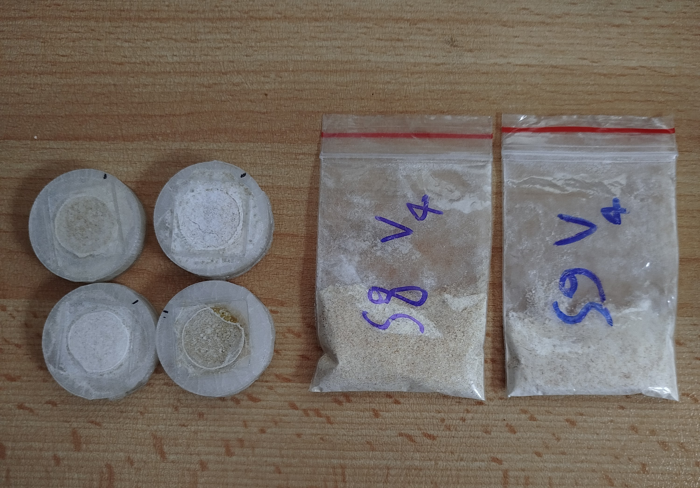

# FTIR Backward Compatibility – Calibration Set & Machine Learning Framework

## 📌 Overview
This project focuses on developing a **calibration set** and a **machine learning framework** to ensure **backward compatibility** between FTIR spectrometers of the same hardware type.  
The main goal was to design, measure, and model powdered material mixtures to predict component concentrations using **Partial Least Squares (PLS) regression**, while evaluating the **cross-device performance** and **hardware-induced variability**.

The work was conducted during an internship at **Si-Ware Systems** under the supervision of **Eng. Samir Abo Zaid**, as part of the **ITI Graduation Project 2024/2025**.

---

## 🎯 Objectives
1. Develop an accurate **PLS regression model** for NIR spectra prediction.
2. Design a **calibration set** using **Latin Hypercube Sampling (LHS)**.
3. Ensure **backward compatibility** across devices of the same hardware type.
4. Analyze the **impact of sample holders** (plastic vs glass) on spectral stability.
5. Use **Principal Component Analysis (PCA)** to investigate device-induced variability.

---

## 🛠 Tools & Technologies
- **FTIR Spectrometers** (Si-Ware Systems Lab)
- **SOLO software** (Eigenvector Research) – for PLS & PCA modeling
- **Python** (data formatting & preprocessing tests)
- **Excel** (sample design & composition tracking)
- **Standard Normal Variate (SNV)** & **Mean Centering** preprocessing
- **Latin Hypercube Sampling (LHS)** – for experimental design

---

## 📂 Project Workflow

### 1. Literature Review
- Studied **FTIR spectroscopy fundamentals**.
- Reviewed **PCA** and **PLS regression** theory for multivariate spectral analysis.

### 2. Calibration Set Design
- **First trial**: 20 samples, 0–10 g per ingredient via LHS → moderate correlation (~0.29) between variables.
- **Improved trial**: LHS with **column sum constraint = 10 g** → increased variability, reduced multicollinearity.
- Materials: **Starch (ST)**, **Protein (P)**, **Vitamin C (VC)**, **Na₂SO₄ (Salt)**.

### 3. Spectral Data Acquisition
- Measurements in **plastic bags** and **glass holders**.
- Glass holders improved stability and reduced noise.

### 4. Data Preprocessing
- **Initial approach**: First derivative → caused complexity & poor generalization.
- **Final approach**:  
  1. Transmission → Absorbance (log(1/T))  
  2. Standard Normal Variate (SNV) correction  
  3. Mean centering

### 5. Modeling
- **PLS regression** with different latent variables (5 → 7 → 9).
- **Oversampling**: 3 measurements per sample to capture device variability.
- **Cross-validation**: Venetian blinds method (15 segments).
- **LODO (Leave-One-Device-Out)** testing for realistic cross-device assessment.

### 6. Evaluation
- **First Trial Models**:
  - Model 1 (Plastic, Bad Preprocessing) → Poor performance due to added complexity.
  - Model 2 (Plastic, Good Preprocessing) → Slight improvement, but noise persisted.
  - Model 3 (Glass, Good Preprocessing) → Better stability but still weak due to mixture design.
- **Second Trial Models**:
  - Glass holders, optimized preprocessing, oversampling (3× per sample).
  - **PLS regression** with latent variables tuned (7–9).
  - **Cross-validation**: Venetian blinds method (15 segments).
  - **LODO (Leave-One-Device-Out)** testing for realistic cross-device assessment.

### 7. PCA Analysis
- PCA on mean spectra per device revealed one **outlier device** with a shift in **PC1 (92% variance)**.

---

## 📊 Results

| Model Type | Holder | Preprocessing | R² (ST) | R² (P) | R² (VC) | R² (Salt) |
|------------|--------|---------------|---------|--------|---------|-----------|
| First Trial – Model 1 | Plastic | Bad | 0.50 | 0.33 | 0.58 | 0.15 |
| First Trial – Model 2 | Plastic | Good | 0.51 | 0.22 | 0.48 | 0.27 |
| First Trial – Model 3 | Glass | Good | 0.62 | 0.74 | 0.17 | 0.23 |
| **Second Trial (Final)** | Glass | Good + Oversampling | **0.92** | **0.86** | **0.91** | **0.75** |

- **Cross-spectrometer evaluation**: Good performance on 3 out of 4 devices; one device showed reduced performance due to hardware/sample variation.
- **LODO test**: Slight drop in performance but confirmed backward compatibility.

---

## 📷 Suggested Images to Include
### Spectra – Glass vs Plastic Holders

### PCA Plot

### Preprocessing Data

### Calibration set photo

---

## 🚀 How to Use
Since the modeling was performed using **SOLO**, to reproduce:
1. Open the provided `.mat` project file.
2. Load the calibration spectra data.
3. Apply the documented preprocessing (SNV + Mean Centering).
4. Train the PLS model with **9 latent variables**.
5. Run **cross-validation** and **LODO tests**.

---

## 👥 Team
- **[Rowina Reda](https://www.linkedin.com/in/rowaina-reda/)**  
- **[Salma Bassem Elfeel](https://www.linkedin.com/in/salmaelfeel/)**  

**Supervisor:** Eng. **[Eng. Samir Abo Zaid](https://www.linkedin.com/in/samir-abozyd-04b02ba1/)** – Si-Ware Systems

---

## 🙏 Acknowledgment
Special thanks to **Si-Ware Systems** for providing the FTIR devices, lab access, and expert guidance throughout the project.  
We also appreciate the **Information Technology Institute (ITI)** for facilitating this opportunity.

---

## 📜 License
This project is shared under the **MIT License** unless otherwise stated.
